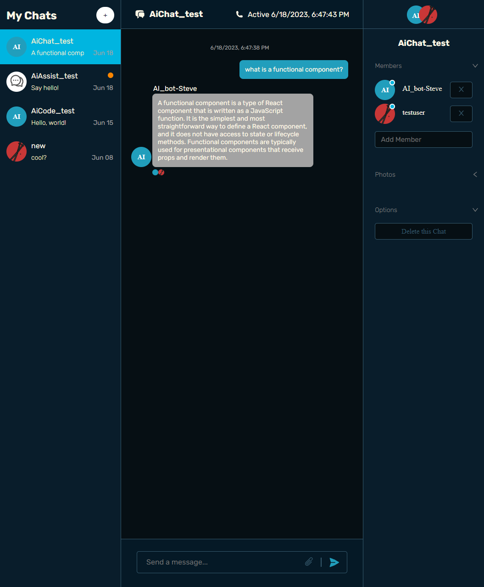
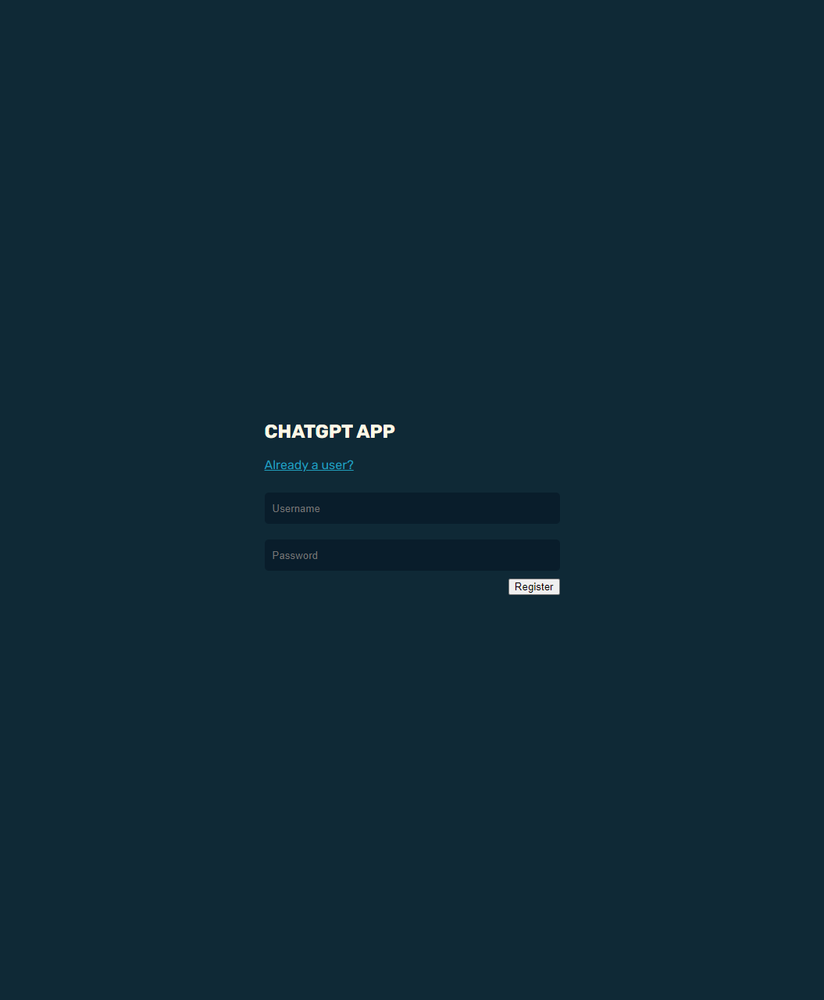
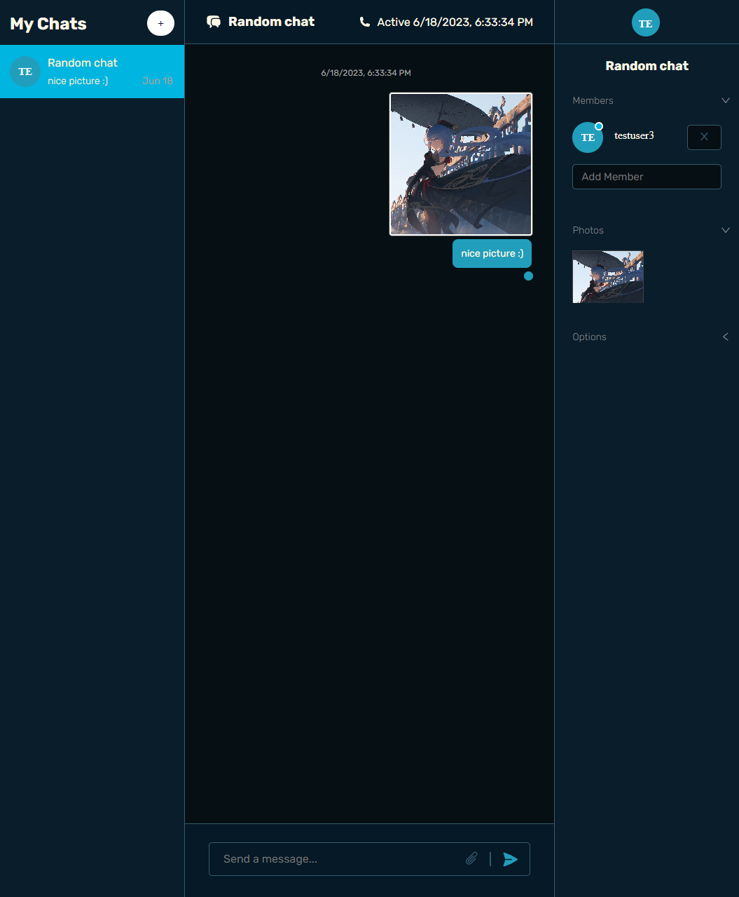

# Vite/Chat Engine/OpenAI chat application

## Features

- Chat Engine provided chatting interface
- Chat Engine registration
- Chat Engine login
- Add/select chat room, add members
- Custom chatroom header
- Custom send message form with attachments and attachment preview
- OpenAi powered chat responses, code responses and auto-complete

## Technologies used

- Vite
  - frontend build tooling
- Chat Engine
  - chat API and also UI elements
- OpenAI API
  - used as chatbots for general chat responses, code responses and message completion
- React
  - frontend library
- Redux Toolkit
  - state management
- RTK Query
  - API calls
- React Router
  - navigation
- heroicons
  - customizable icons
- node.js
  - JS runtime
- Express.js
  - backend framework for web apps

## Application Preview

### Other views

## Credits

Project based on [EdRoh](https://www.youtube.com/@EdRohDev) fullstack tutorial.
